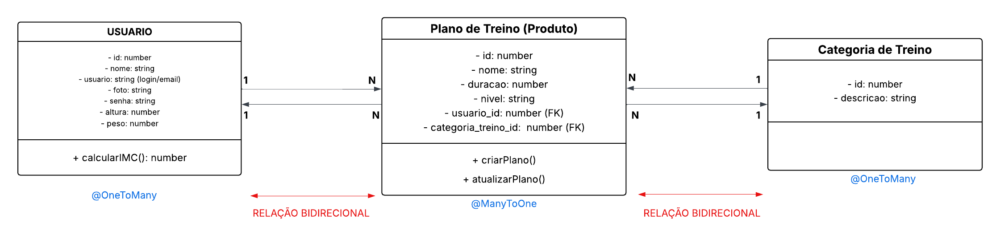

# 🏋️ FitTrack – Backend de Aplicativo Fitness Personalizado

## 📌 Descrição do Projeto

O **FitTrack** é um sistema backend desenvolvido com o framework **NestJS**, cujo objetivo é gerenciar usuários e seus treinos personalizados. A aplicação permite o cadastro de usuários, a definição de objetivos de treino e o registro de treinos realizados, organizando essas informações de forma estruturada e relacional.

O sistema também conta com uma funcionalidade especial de **cálculo do IMC** (Índice de Massa Corporal), realizada a partir dos dados de altura e peso do usuário, auxiliando no acompanhamento da saúde física.

---

## 🎯 Modelo de Negócio

**Aplicativo de Fitness Personalizado**

---

## 👤 Usuário Final

Pessoas interessadas em melhorar sua saúde, condicionamento físico e qualidade de vida, utilizando um sistema que organiza treinos por objetivo e acompanha dados corporais de forma simples e intuitiva.

---

## 🧩 Entidades do Sistema

### Usuário
Representa a pessoa que utiliza o aplicativo.

- `id`
- `nome`
- `usuario` (login/email)
- `foto`
- `senha`
- `altura`
- `peso`

### Objetivo (Categoria de Treino)
Representa a classificação ou finalidade do treino.

- `id`
- `descricao`

**Exemplos:** Hipertrofia, Cardio, Emagrecimento, Mobilidade.

### Plano de Treino (Produto)
Representa o registro principal do sistema, equivalente ao conceito de "Produto" apresentado nos slides do desafio.

- `id`
- `nome`
- `duracao` (em minutos)
- `nivel` (iniciante, intermediário, avançado)
- `usuario` (chave estrangeira)
- `categoriaTreino` (chave estrangeira)

---

## 📊 Diagrama de Classes (UML) / DER

O Diagrama Entidade–Relacionamento (DER) foi elaborado para representar visualmente a estrutura do banco de dados e os relacionamentos entre as entidades do sistema.
O modelo é composto por três entidades principais:

- Usuário
- Categoria de Treino
- Plano de Treino

**O DER garante:**
- Integridade referencial entre as tabelas
- Correta aplicação dos relacionamentos 1:N
- Organização dos dados conforme as regras de negócio do sistema

<div align="center">
  
</div>

---

## 🔗 Relacionamentos

- Um **Usuário** pode possuir vários **Treinos** (1:N)
- Um **Objetivo** pode estar associado a vários **Treinos** (1:N)
- Cada **Treino** pertence a um único **Usuário** e a um único **Objetivo**

**Modelo aplicado conforme o desafio:**
- N–1 Treino → Objetivo
- 1–N Usuário → Treino

---

## ⚙️ Funcionalidades do Sistema

- CRUD completo de **Usuário**
- CRUD completo de **Categoria de Treino**
- CRUD completo de **Plano de Treino**
- Busca de treinos por ID
- Busca de treinos por nível
- Tratamento de erro para registros não encontrados
- Cálculo automático de **IMC**

---

## 🧠 Regras de Negócio

- O cálculo do IMC é realizado no service do usuário
- O IMC não é armazenado no banco de dados
- Um treino só pode ser criado se estiver associado a um usuário e a um objetivo válidos
- As entidades seguem boas práticas de normalização e integridade referencial

---

## 🧮 Funcionalidade Especial – Cálculo de IMC

O **IMC** (Índice de Massa Corporal) é calculado com base na altura e peso do usuário, utilizando a fórmula:

```
IMC = peso / (altura × altura)
```

Essa funcionalidade atende ao requisito especial definido para o modelo de negócio de **Aplicativo de Fitness Personalizado**.

---

## 🧪 Testes

Os testes da API foram realizados utilizando a ferramenta **Insomnia**, validando:

- Cadastro de usuários, objetivos e treinos
- Listagem de registros
- Busca por ID
- Busca de treinos por nível
- Atualização de dados
- Exclusão de registros
- Tratamento de erros (ID inexistente)

As evidências dos testes estão documentadas por meio de prints das requisições e respostas.

---

## 🛠️ Tecnologias Utilizadas

- **NestJS**
- **TypeScript**
- **TypeORM**
- **MySQL**
- **Insomnia**

---

## 🚀 Como Executar o Projeto

1. **Instalar as dependências:**
   ```bash
   npm install
   ```

2. **Executar a aplicação em modo desenvolvimento:**
   ```bash
   npm run start:dev
   ```

3. **A aplicação será iniciada em:**
   ```
   http://localhost:4000
   ```

---

## 📌 Considerações Finais

O **FitTrack** é um projeto backend desenvolvido com foco em organização, boas práticas de desenvolvimento e clareza na modelagem de dados. O sistema atende integralmente aos requisitos do desafio proposto, apresentando um CRUD completo com relacionamento entre entidades e uma funcionalidade especial alinhada ao modelo de negócio escolhido.
